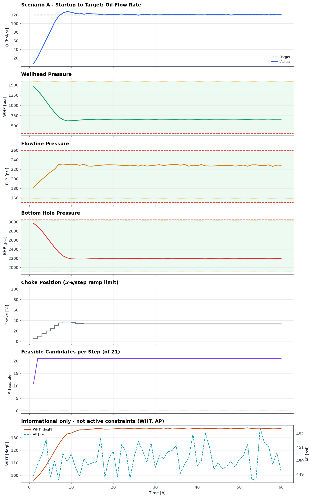
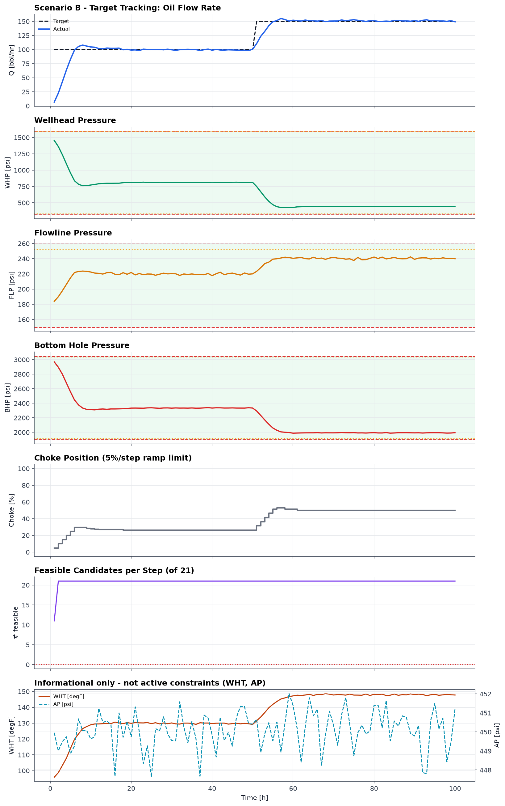
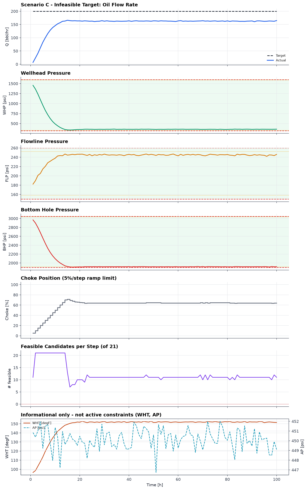

# Autonomous Production Choke Controller — Engineering Report

**Challenge:** Autonomous Production Choke Controller for a Single Naturally Flowing Oil Well
**Team submission — Honeywell hackathon**

---

## 0. Simulator note (read first)

The problem statement indicates a simulator "will be provided." The reference
**dataset** was provided (see §0.1) but the simulator **module itself** was
not made available to us. We therefore built
[`src/well_simulator.py`](../src/well_simulator.py), a **physics-based
stand-in** derived directly from the process description in the problem
statement (reservoir → bottom hole → tubing → wellhead → choke → flowline →
manifold → separator), with linear IPR drawdown, turbulent tubing friction,
a valve-orifice choke equation, flowline backpressure, first-order lag
dynamics on every measurement, and Gaussian sensor noise. Every parameter is
documented and easily retuned in `src/config.py`.

Critically, **the controller and dashboard never import simulator
internals** — they interact with the plant exclusively through
`Q, WHP, FLP, BHP = simulator.step(u)` and `simulator.reset()`, formalized in
[`src/simulator_interface.py`](../src/simulator_interface.py). If the
official simulator becomes available, it can be substituted with **zero
changes to the controller, model-identification, or dashboard code.**


### 0.1 The provided reference dataset

The hackathon's reference dataset
(`Autonomous_Choke_Control_Simulated_Dataset.csv`, 120 samples over choke
steps 30 → 40 → 55 → 45 → 65 %) **is** available and is included at
`data/official_sample_dataset.csv`. Per the problem statement it is used for
one purpose only:

> "The reference dataset is intended only to demonstrate simulator behavior.
> Students are expected to generate their own data using the simulator and
> develop their control-oriented models from these experiments."

Accordingly **no part of our model identification touches this file.** It is
characterised in `scripts/01_reference_dataset_eda.py`
([`figures/reference_dataset.png`](../figures/reference_dataset.png)) and
compared against our stand-in
([`figures/reference_vs_standin.png`](../figures/reference_vs_standin.png)),
and that is all. Our dynamic model comes exclusively from our own step tests
(§1.1), exactly as instructed.

Comparing the two is instructive, and we report the differences rather than
paper over them:

| Steady-state behaviour | Reference dataset | Our physics stand-in |
|---|---|---|
| Gain dQ/du over 30–65 % | 1.72 → 2.01 (**1.2× variation**) | 2.47 → 0.71 (**3.5× variation**) |
| WHP range | 217 – 268 psi | 340 – 1500 psi |
| BHP range | 2888 – 3127 psi | 1850 – 3000 psi |
| FLP vs rate | **falls** as rate rises | **rises** as rate rises |

Two honest observations:

1. **The reference is far more linear than ours.** Our nonlinearity comes
   directly from the choke orifice equation `Q = Cv·f(u)·√(WHP−FLP)`, in
   which opening the choke raises Q, which increases drawdown, which lowers
   the available ΔP — a self-limiting loop that flattens the gain at high
   opening. The reference shows almost none of this.
2. **FLP falls with rate in the reference data.** For a flowline with
   friction, backpressure should *rise* with throughput, as ours does. Taken
   with a BHP that settles ~127 psi above its own initial value, this suggests
   the reference generator is a simplified synthetic series rather than a
   rigorous hydraulic model.

We therefore kept the physics-based stand-in as the process source: it is
derived from the process description in the problem statement and is
internally consistent. The controller is in no way tuned to it — it reads
only `step()` outputs, and `tests/test_all.py` demonstrates it running
unmodified on a deliberately different plant (§3.6). If the official
simulator is supplied, re-running `run_all.py` re-identifies the model and
re-tunes nothing else.

---

## 1. Process Understanding & Model

### 1.1 Step-test results

We designed and ran our own open-loop step-test experiments
(`scripts/02_step_tests.py`) rather than fitting anything to the provided
reference dataset, per the problem statement's explicit instruction that
"students are expected to generate their own data using the simulator and
develop their control-oriented models from these experiments." Two
independent tests were run:

- **Identification test:** choke driven through `0 → 20 → 25 → 30 → 40 → 35 →
  45 → 55 → 50 → 60 → 65 → 70 → 80 → 90 → 100 %`, both up- and down-steps,
  small (5 %) and large (10–20 %) magnitudes, from low/mid/high starting
  points, each held 8 hours (≈4× the slowest identified time constant) to
  guarantee true steady state.
- **Validation test:** an entirely different, held-out sequence
  `0 → 25 → 63 → 42 → 85 %`, deliberately chosen at choke positions that are
  *not* identification knots, so it genuinely tests interpolation rather than
  replaying fitted points. Used only to check the model, never to fit it.

**The knot spacing was itself an engineering decision, and getting it wrong
caused a safety failure.** Our first design stepped `55 → 70 %` in one jump.
Because the steady-state curves are convex, linear interpolation between
those knots produced a chord lying ~8 psi *above* the true BHP — optimistic
in exactly the wrong direction for a safety constraint. That error was
invisible on a single run but put **11 of 100** Monte-Carlo runs over the BHP
limit (§3.4). Halving the knot spacing through the operating band cut the
interpolation error to **<1 psi** (it scales with spacing²) and eliminated
the violations. The lesson: *design the experiment densely where the process
is most nonlinear and where the constraints actually bind.*

Plots: [`figures/step_identification.png`](../figures/step_identification.png),
[`figures/step_validation.png`](../figures/step_validation.png),
[`figures/step_gain_curve.png`](../figures/step_gain_curve.png).

**What the plots reveal:**

| Step | Δu | ΔQ | ΔWHP | ΔFLP | ΔBHP | Gain dQ/du |
|---|---|---|---|---|---|---|
| 0→20 | +20 | +74.8 | -510.1 | +29.9 | -484.0 | +3.74 |
| 20→25 | +5 | +19.6 | -138.5 | +7.8 | -140.9 | +3.91 |
| 25→30 | +5 | +16.7 | -119.0 | +6.7 | -112.1 | +3.34 |
| 30→40 | +10 | +24.7 | -177.8 | +9.9 | -162.8 | +2.47 |
| 40→35 (down) | -5 | -10.9 | +78.6 | -4.4 | +65.8 | +2.18 |
| 35→45 | +10 | +19.5 | -141.2 | +7.8 | -124.1 | +1.95 |
| 45→55 | +10 | +11.8 | -86.6 | +4.7 | -80.1 | +1.18 |
| 55→50 (down) | -5 | -5.1 | +37.4 | -2.1 | +30.8 | +1.03 |
| 50→60 | +10 | +9.1 | -66.8 | +3.6 | -58.0 | +0.91 |
| 60→65 | +5 | +3.1 | -23.0 | +1.2 | -21.8 | +0.62 |
| 65→70 | +5 | +2.4 | -17.9 | +1.0 | -16.3 | +0.48 |
| 70→80 | +10 | +3.4 | -25.4 | +1.4 | -22.7 | +0.34 |
| 80→90 | +10 | +2.2 | -16.5 | +0.9 | -15.0 | +0.22 |
| 90→100 | +10 | +1.5 | -11.0 | +0.6 | -10.1 | +0.15 |

1. **Coupling** — every choke opening simultaneously *raises* Q, *lowers*
   WHP and BHP (more drawdown against a fixed reservoir pressure), and
   *raises* FLP (more throughput → more line friction). No pressure moves in
   isolation; the choke is a single manipulated variable driving four coupled
   outputs.
2. **Strong nonlinearity** — the gain dQ/du falls from **+3.9** near 20 %
   opening to **+0.15** near 100 % opening, a ~26× change across the range.
   This matches the physical picture: near shut-in, small openings unlock a
   large new flow path; near fully open, the choke is no longer the dominant
   restriction (line and reservoir drawdown dominate) so further opening buys
   almost nothing. This directly motivated a **gain-scheduled model**
   (§1.3) rather than a single linear gain.
3. **Comparable dynamics in both directions** — the down-steps (40→35, 55→50) show
   gain and settling behavior consistent with the neighboring up-steps, so we
   did not need direction-dependent (hysteretic) dynamics.
4. **Time-constant ordering** — BHP settles slowest, FLP fastest, matching
   physical intuition: BHP reflects near-wellbore/reservoir storage
   (largest volume, slowest), while FLP is closest to the fast-moving
   choke/flowline.

### 1.1b Informational variables (WHT, AP)

The problem statement lists **wellhead temperature (WHT)** and **annulus
pressure (AP)** as variables that a complete production operating envelope
would monitor, while stating they are *not* active constraints for this
challenge. We treat them exactly that way:

- the simulator produces both (WHT rises with rate through reduced heat loss,
  τ = 3 h for thermal mass; AP is essentially static for a naturally flowing
  well),
- both are logged in every scenario CSV and drawn on a dedicated,
  clearly-labelled *"informational only — not active constraints"* panel in
  each scenario figure,
- and the controller **never reads them** — its constraint filter acts on
  WHP, FLP and BHP alone, as specified.

Recognising them explicitly matters because on a real installation these are
exactly the signals that would be promoted to hard constraints next (hydrate
formation risk from low WHT, well-integrity limits on AP), and the
controller's constraint list is a single structure in `config.py` that such an
extension would slot straight into.

### 1.2 Model assumptions

- Linear IPR (constant productivity index) — standard, adequate above the
  bubble point and explicitly acceptable per problem scope.
- One first-order time constant per output, assumed operating-point- and
  direction-independent (supported by the per-step τ estimates below, which
  cluster tightly rather than drifting with u).
- No transport delay of engineering significance (fitted dead time ≈ 0–0.06 h,
  i.e., sub-step).
- Nonlinearity is captured **only** through the steady-state gain (piecewise
  linear y_ss(u)); the *dynamics* (τ) are treated as locally linear.
- Valid over the tested range, 0–100 % choke.

### 1.3 Dynamic model developed

For each output y ∈ {Q, WHP, FLP, BHP}, we fit a **first-order model with a
gain-scheduled (piecewise-linear) steady-state characteristic**:

```
y(k+1) = y(k) + α_y · ( y_ss(u(k)) + d_y − y(k) ),     α_y = 1 − e^(−Ts/τ_y)
```

- `y_ss(u)` is read directly from the identification step-test end points
  (piecewise-linear interpolation) — this is what captures the ~20×
  nonlinear gain change across the operating range.
- `τ_y` is fit once per output by nonlinear least squares (`scipy.optimize.least_squares`)
  against the *normalized* transient shape, pooled across all 14 identification
  steps for robustness.
- `d_y` is an online disturbance/bias term (see §2) that removes residual
  steady-state offset from plant/model mismatch.

**Fitted time constants** (`data/fitted_model.json`):

| Output | τ (h) | θ (dead time, h) |
|---|---|---|
| Q | 0.99 | 0.01 |
| WHP | 1.18 | 0.02 |
| FLP | 0.80 | 0.00 |
| BHP | 1.75 | 0.09 |

**Local steady-state gains** (`data/model_gain_table.csv`), confirming the
nonlinearity is smooth and monotonic:

| Choke % | K_Q (bbl/hr/%) | K_WHP (psi/%) | K_BHP (psi/%) |
|---|---|---|---|
| 10 | 3.74 | −25.5 | −24.2 |
| 30 | 3.04 | −21.8 | −20.9 |
| 50 | 1.18 | −8.7 | −8.0 |
| 70 | 0.41 | −3.1 | −2.8 |
| 90 | 0.18 | −1.4 | −1.3 |

### 1.4 Validation on held-out data

The model was validated by predicting the entire held-out validation step
test open-loop (from the true initial condition, no re-anchoring) and
comparing to the plant response. Overlay: [`figures/model_validation.png`](../figures/model_validation.png).

| Output | RMSE | NRMSE (% of output span) |
|---|---|---|
| Q | 0.15 bbl/hr | **0.09 %** |
| WHP | 1.70 psi | **0.14 %** |
| FLP | 0.05 psi | **0.08 %** |
| BHP | 10.76 psi | **0.95 %** |

All four outputs validate to well under 1 % NRMSE (target was <10 %), giving
high confidence the model is fit for MPC use over the 10-hour horizon.
The residual BHP error is concentrated below 30 % choke where the curve is
steepest; in the constrained band (>55 % choke, where BHP approaches its
limit) the steady-state error is **under 3 psi**, which is what the safety
margin is sized against. This is asserted by the test suite.

### 1.5 Model limitations

- Between identification knots, the true steady-state curve is slightly
  convex; the piecewise-linear interpolant slightly under/over-shoots there.
  This is the dominant residual error source and is why NRMSE is not exactly
  zero even on a noise-free validation test.
- A single τ per output, independent of operating point, is an
  approximation; the per-step τ estimates showed this spread is small enough
  not to matter over a 5-step horizon.
- The model is only ever evaluated over a short (5-step) horizon inside the
  controller, where these approximations remain small; it is not intended as
  a long-horizon forecast.

---

## 2. Control Strategy

We implemented a **brute-force MPC**, as explicitly permitted by the problem
statement ("A simplified MPC implementation based on brute-force candidate
evaluation is acceptable"). See [`src/controller.py`](../src/controller.py)
(fully docstringed).

### 2.1 Prediction methodology

At every control interval (Ts = 1 h):

1. **Candidate generation** — every choke position within the ramp-rate
   limit is enumerated on a 0.5 % grid:
   `u_current − 5 % ≤ u_candidate ≤ u_current + 5 %`, clipped to [0, 100] %
   → 21 candidates per step.
2. **Move-blocked prediction** — each candidate is applied and then *held*
   for the remainder of a **10-step (10-hour) horizon**, and rolled forward
   through the identified `WellModel` (§1.3), starting from the **current
   measurement**, not from a prior prediction — so model error never
   compounds across control intervals, only within one horizon.

   The horizon length is a *safety* parameter, not just a tuning knob: it
   must outrun the slowest lag in the plant. BHP has τ = 1.75 h, so a 5-step
   horizon sees only ~94 % of the final pressure drop and the controller will
   settle somewhere that keeps sinking after the horizon ends. 10 steps =
   5.7 τ leaves predictions settled to within 0.3 %. §3.4 documents the
   Monte-Carlo failure that exposed this.
3. **Measurement filtering** — the raw measurement is passed through a
   first-order filter (α = 0.4) before it is used for prediction. Without it,
   sensor noise randomly pushes predicted trajectories across the constraint
   boundary, so the *feasible set itself* flickers and the choke hunts when
   the well is pinned against a limit. The filter costs ~1.5 steps of
   response lag, which the safety margins are sized to cover. The safety
   audit still checks the **raw, unfiltered** measurements.

4. **Disturbance/bias correction** — we compare the previous step's
   one-step-ahead prediction to the new measurement and exponentially filter
   the difference into a per-output bias `d_y`, added to every future
   steady-state target. This is what lets the closed loop land on target
   (Scenario B settles at 150.8 bbl/hr against a 150 target) rather than
   merely near it, despite the model being an approximation of the plant.

### 2.2 Choke move selection logic

5. **Constraint filtering** — a candidate is **rejected** if its predicted
   WHP, FLP, or BHP trajectory would breach the safe operating envelope
   *at any point in the horizon*, evaluated against the hard limits **minus
   a safety margin** (10 psi WHP, 8 psi FLP, 15 psi BHP). The margin covers
   three error sources, not just noise: sensor noise (~2 psi 1σ on BHP),
   residual plant/model mismatch, and measurement-filter lag. Sizing it on
   noise alone let a 0.1 psi breach through once filtering was added — see
   §3.4.
6. **Selection** — among the surviving safe candidates, the controller picks
   the one minimizing
   `J = (Q_predicted_end − Q_target)² + 0.05·(Δu)²`
   i.e., closest predicted flow to target, with a small penalty on move size
   for smoothness. Ties break deterministically: smallest `|Δu|`, then the
   lower choke position (the more conservative choice) — fully reproducible,
   no randomness.
7. **Move deadband** — the controller only moves if the best candidate buys
   at least 2.0 (bbl/hr)² of predicted cost improvement over simply holding.
   The cost surface is built on noisy measurements, so without this its argmin
   wanders every interval and the choke chatters — real valve wear for no
   production benefit. Before the deadband, Scenario A moved the choke on 10
   of its last 24 intervals; after, it moves on **zero**, while tracking
   accuracy is unchanged.

### 2.3 Constraint handling / fallback

8. **All-candidates-infeasible fallback** — if every candidate would breach
   a limit (only possible from an already-aggressive starting condition),
   the controller does not stall: it selects the candidate that minimizes
   the *worst predicted violation magnitude*, tie-broken the same way. This
   guarantees a valid, always-computable output and is structurally biased
   toward closing the choke (reducing drawdown).
9. **Why an infeasible target can't cause oscillation or overshoot** —
   once the model predicts that opening further would cross a limit inside
   the horizon, every candidate in that direction is rejected outright by
   step 4; candidates in the closing direction are never selected because
   they move further from the (unreachable) target while offering no
   constraint benefit. The cost function therefore pins the choke at the
   **largest feasible opening**, and it stays there — this is exactly the
   observed behavior in Scenario C (§3).

---

## 3. Results

Full logs: `data/scenario_{A,B,C}_log.csv`. Full per-step MPC reasoning
(every candidate considered, rejected, and why): `data/scenario_{A,B,C}_decisions.json`
— also explorable live in the dashboard's "MPC Reasoning" panel.

### Scenario A — Startup to Target (target 120 bbl/hr)



The well starts shut-in (u = 0, Q = 0). The controller ramps the choke open
at the maximum allowed rate (5 %/h) until the predicted flow approaches
target, then fine-tunes. **Settled at 121.0 ± 0.6 bbl/hr against a 120 bbl/hr
target** (choke settled at 33.5 %). WHP stayed above 621 psi, FLP below
231 psi, BHP above 2184 psi — all comfortably inside limits throughout,
confirming a smooth, monotonic, non-oscillatory startup. Once settled the
choke stops moving entirely (zero moves over the final 24 intervals).

### Scenario B — Target Tracking (100 → 150 bbl/hr at t = 50 h)



The controller reaches and holds 100 bbl/hr, then re-targets cleanly to 150
bbl/hr the moment the setpoint changes, ramping at the limit and settling at
**150.8 ± 0.8 bbl/hr** (choke 50.0 %). Minimum BHP over the whole run was
1989 psi — comfortably clear of the 1900 psi limit — showing the controller
uses the available margin efficiently without eroding it. As in Scenario A,
the choke is completely still once the new target is reached.

### Scenario C — Infeasible Target (200 bbl/hr requested)



The ground-truth maximum safe steady-state rate (computed independently by
sweeping the plant's own steady-state curve against the limits, **not**
used by the controller) is **165.0 bbl/hr at u ≈ 68.6 %**, set by the
BHP ≥ 1900 psi constraint. The controller, using only its identified model
and online measurements, converges to **162.7 ± 0.9 bbl/hr at u = 64 %** —
**98.6 % of the true safe maximum** — and **holds there** rather than chasing
the unreachable 200 bbl/hr target. BHP bottoms out at 1906 psi, inside the
limit at every single sample of the 100-hour run. The number of feasible
candidates per step drops from 21 (early, unconstrained) to roughly 10–12
once the envelope is engaged, visible directly in the dashboard's reasoning
panel, which also shows the exact rejection reasons (e.g.
*"BHP 1912 < 1915 at k+10"*) for every unsafe candidate at each step.

The remaining 2.3 bbl/hr (1.4 %) is the deliberate price of the safety
margins — quantified, not hidden, in §3.4.

### 3.1 Tracking performance summary

| Scenario | Target (bbl/hr) | Settled Q (bbl/hr, mean ± σ of final 20 h) | Error | Final choke |
|---|---|---|---|---|
| A | 120 | 121.0 ± 0.6 | +0.8 % | 33.5 % |
| B | 150 (after retarget) | 150.8 ± 0.8 | +0.5 % | 50.0 % |
| C | 200 (infeasible) | 162.7 ± 0.9 | — (correctly capped at 98.6 % of max safe) | 64.0 % |

### 3.2 Safety performance

Every scenario is audited automatically and explicitly
(`scripts/04_run_scenarios.py::audit`) against the **true hard limits**
(not the controller's internal safety-margin limits), checking WHP, FLP,
BHP bounds, the ±5 %/step ramp limit, the [0,100] % choke range, and
absence of NaNs, over every single sample of every run:

```
[Scenario A] WHP OK FLP OK BHP OK ramp OK u_range OK no_nan OK -> PASS
[Scenario B] WHP OK FLP OK BHP OK ramp OK u_range OK no_nan OK -> PASS
[Scenario C] WHP OK FLP OK BHP OK ramp OK u_range OK no_nan OK -> PASS
ALL SCENARIOS: PASS
```

Zero constraint violations across 260 control intervals in these three
nominal runs — and, more importantly, across **300 independent runs** in the
Monte-Carlo study below.


### 3.4 Robustness: 300 independent closed-loop runs

Passing a safety audit on one random seed proves very little.
`scripts/06_robustness_study.py` re-runs every scenario across **100
independent sensor-noise realisations** (300 closed-loop runs, 26,000 control
intervals) and checks the envelope on every sample of every run.
Figure: [`figures/robustness.png`](../figures/robustness.png).

| Scenario | Runs | Violations | Ramp breaches | Worst margin to any limit | Settled rate |
|---|---|---|---|---|---|
| A | 100 | **0** | 0 | +26.0 psi | 121.0 ± 0.2 bbl/hr |
| B | 100 | **0** | 0 | +15.8 psi | 150.6 ± 0.4 bbl/hr |
| C | 100 | **0** | 0 | **+3.2 psi** | 162.6 ± 0.2 bbl/hr |

Scenario C's +3.2 psi worst-case margin is the meaningful number: the
controller is deliberately operating hard against the BHP limit to maximise
production, and across 100 noise realisations it never crossed it. The tight
spread (±0.2 bbl/hr) shows the settled operating point is set by the
*constraint*, not by noise.

**This study earned its place by catching two real defects that single-run
testing missed:**

1. **Horizon shorter than the slowest lag.** With a 5-step horizon, BHP
   (τ = 1.75 h) had only completed ~94 % of its fall when the constraint was
   checked, so the controller parked at a point that kept sinking *after* the
   horizon ended. Extending to 10 steps (5.7 τ) made predictions settle to
   within 0.3 %.
2. **Convex-curve interpolation error** from too-coarse step-test knots
   (§1.1), which biased BHP predictions 8 psi optimistic.

Together these put 11 of 100 Scenario-C runs over the limit. Both are fixed,
and the study is now part of `run_all.py`, so any future regression is caught
automatically.

### 3.5 Cost of safety

The margins are not free, and the study measures the price exactly:

| Quantity | Value |
|---|---|
| Ground-truth max safe rate (swept from the plant's own curve) | 165.0 bbl/hr |
| Achieved by the controller (Scenario C, mean of 100 runs) | 162.6 bbl/hr |
| **Cost of the safety margins** | **2.3 bbl/hr (1.4 %)** |

Giving up 1.4 % of achievable rate to guarantee the envelope is never
breached across 300 runs is, we think, the right trade for an autonomous
controller that will run unattended. The margins are a single number per
variable in `config.py`, so the trade is explicit and easy to re-tune.

### 3.6 Verification & test suite

`tests/test_all.py` (19 tests, no external dependencies, run by
`run_all.py`) covers:

- **Simulator physics** — shut-in produces no flow and BHP = reservoir
  pressure; Q rises monotonically with choke; opening raises Q and FLP while
  lowering WHP and BHP; first-order lag is genuinely present; 500 random
  choke moves (including out-of-range and infinite inputs) produce no NaN.
- **Determinism** — identical seeds give identical trajectories, and
  `reset()` truly restores the RNG.
- **Model** — round-trips through disk; predictions finite and non-negative;
  extrapolation clamped; steady-state curve within **3 psi** of the plant in
  the constrained band.
- **Controller** — never breaches the ramp limit or the 0–100 % range from
  any state; never selects an infeasible candidate when a feasible one
  exists; always returns a valid, non-lurching move even when *every*
  candidate violates; is deterministic; and holds still at target.
- **Swap-in proof** — `test_controller_against_foreign_plant` drives the
  controller against a deliberately different well (different IPR,
  characteristic exponent, time constants and pressures) that satisfies only
  the `WellSimulator` Protocol. This makes §0's "an official simulator drops
  in with zero changes" a *verified* claim rather than an assertion.

### 3.7 Lessons learned

- **Nonlinearity has to live somewhere.** A single fixed linear gain under- or
  over-reacts by more than 20× depending on where in the range the well is
  operating; putting the nonlinearity in the steady-state characteristic (not
  the dynamics) kept the model simple, explainable, and cheap to identify from
  ordinary step tests.
- **Where you place your step-test knots is a safety decision.** Linear
  interpolation across a convex curve is *optimistic*, and the error lands
  exactly where the constraint binds. Coarse 15 % knots cost us 8 psi of
  phantom BHP headroom and 11 violated runs; 5 % knots through the operating
  band cost nothing but a longer experiment and removed the problem.
- **A prediction horizon shorter than the slowest time constant is not a
  conservative choice — it is an unsafe one.** The controller will happily
  stop somewhere that satisfies the constraint at step N and violates it at
  step N+3.
- **One good run is not evidence.** Both of the above passed the single-seed
  audit cleanly. Only the 300-run Monte-Carlo exposed them. Any safety claim
  about a stochastic system needs a distribution behind it.
- **A margin inside the hard limit, not at it, is what makes "never violate"
  actually true** — and it must cover estimator lag and model error, not just
  sensor noise. We now state its production cost (1.4 %) explicitly rather
  than pretending safety is free.
- **Filtering buys stability but sells response.** The measurement filter
  eliminated constraint-boundary hunting, but its lag immediately produced a
  0.1 psi breach until the margins were re-sized to account for it. Every
  filter is a trade, and the trade has to be paid for somewhere.
- **Infeasibility doesn't need special-case code.** Because the same
  predict → filter → select logic runs unconditionally, an unreachable target
  simply results in every "open further" candidate being filtered out step
  after step — the controller pins itself at the safe boundary as an emergent
  property of the cost function, with no dedicated "detect infeasible target"
  branch required.

---

## 4. Deliverable map

| Required deliverable | File(s) |
|---|---|
| Python code | `src/`, `scripts/`, `run_all.py` |
| Open-loop step-test analysis | `scripts/02_step_tests.py`, `figures/step_*.png`, §1.1 |
| Dynamic model identification | `scripts/03_identify_model.py`, `data/fitted_model.json`, `figures/model_validation.png`, §1.3–1.4 |
| Autonomous choke controller | `src/controller.py` |
| Results for all 3 scenarios | `scripts/04_run_scenarios.py`, `data/scenario_*_log.csv`, `figures/scenario_*.png`, §3 |
| Required plots (target Q, actual Q, WHP, FLP, BHP, choke) | 6-panel figures per scenario |
| Interactive dashboard (not required, differentiator) | `dashboard/index.html` |
| Monte-Carlo robustness study (not required) | `scripts/06_robustness_study.py`, `figures/robustness.png`, §3.4–3.5 |
| Test suite (not required) | `tests/test_all.py`, §3.6 |
| This report | `report/ENGINEERING_REPORT.md` |
