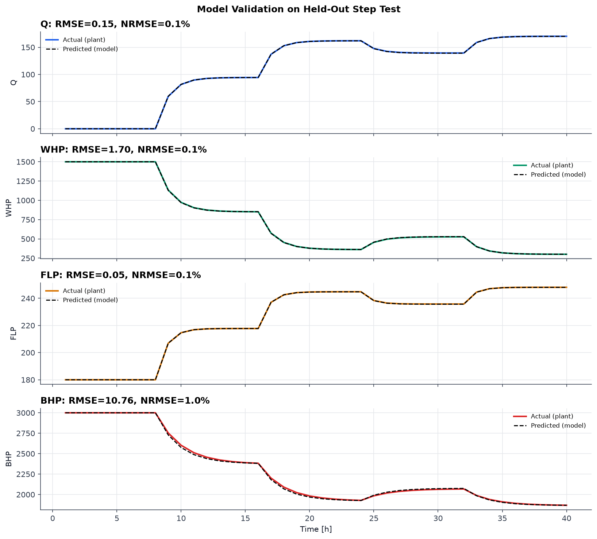
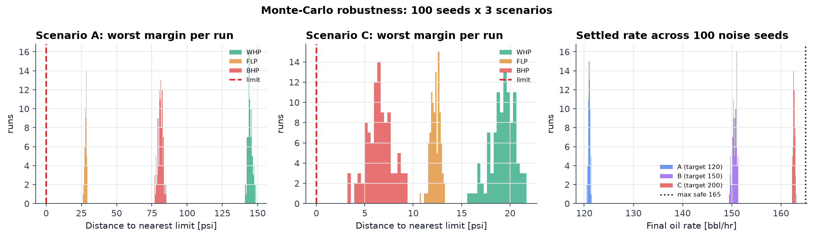

# Autonomous Production Choke Controller — Engineering Report

Challenge: Autonomous Production Choke Controller for a Single Naturally Flowing Oil Well

---

## 0. A note on the simulator

The problem statement says a simulator will be provided. We did get the reference
dataset (more on that in 0.1), but the simulator module itself never became
available to us. So we wrote our own stand-in, `src/well_simulator.py`, working
from the process description given in the problem statement: reservoir, bottom
hole, tubing, wellhead, choke, flowline, manifold, separator.

It models linear IPR drawdown, turbulent friction in the tubing, a valve-orifice
equation at the choke, flowline backpressure, a first-order lag on every measured
variable, and Gaussian sensor noise. All the parameters sit in `src/config.py`
with comments explaining where each number came from, so they are easy to retune.

One design decision mattered more than the rest. The controller and the dashboard
never import anything from the simulator. They only ever call
`Q, WHP, FLP, BHP = simulator.step(u)` and `simulator.reset()`. We wrote that
contract down as a Protocol in `src/simulator_interface.py`. If the official
simulator turns up later, it can be dropped in without touching the controller,
the identification code, or the dashboard.

### 0.1 The reference dataset we were given

The reference dataset (`Autonomous_Choke_Control_Simulated_Dataset.csv`) is
included at `data/official_sample_dataset.csv`. It has 120 samples covering choke
steps of 30, 40, 55, 45 and 65 %. The problem statement is specific about what it
is for:

> "The reference dataset is intended only to demonstrate simulator behavior.
> Students are expected to generate their own data using the simulator and
> develop their control-oriented models from these experiments."

So we used it for exactly that and nothing else. `scripts/01_reference_dataset_eda.py`
plots it and compares it against our stand-in. No part of our model fitting reads
that file. The model comes from our own step tests, described in section 1.1.

The comparison is worth showing, and we would rather report the differences than
quietly ignore them:

| Steady state | Reference dataset | Our stand-in |
|---|---|---|
| Gain dQ/du, 30–65 % | 1.72 to 2.01 (1.2x variation) | 2.47 to 0.71 (3.5x variation) |
| WHP range | 217 to 268 psi | 340 to 1500 psi |
| BHP range | 2888 to 3127 psi | 1850 to 3000 psi |
| FLP against rate | falls as rate rises | rises as rate rises |

Two things stand out.

The reference data is close to linear in choke position. Ours is not. Our
nonlinearity comes straight out of the orifice equation `Q = Cv·f(u)·√(WHP−FLP)`.
Open the choke, flow goes up, drawdown increases, WHP drops, and the pressure
difference driving the flow shrinks. That feedback flattens the gain at high
opening. The reference data barely shows this effect.

The second difference is harder to explain away. In the reference data FLP falls
as rate rises. For a flowline with friction it should do the opposite. Its BHP
also settles about 127 psi above where it started. Our reading is that the
reference series is a simplified synthetic generator rather than a hydraulic
model.

We kept our physics stand-in as the process source because it follows the process
chain in the problem statement and is internally consistent. The controller is
not tuned to it either way. It only sees `step()` output, and one of our tests
runs it against a deliberately different plant to prove that (section 3.6).

---

## 1. Process understanding and model

### 1.1 Step tests

We ran our own open-loop step tests rather than fitting anything to the reference
data, following the instruction quoted above. Two separate experiments:

The identification test drives the choke through 0, 20, 25, 30, 40, 35, 45, 55,
50, 60, 65, 70, 80, 90 and 100 %. That includes steps up and down, small 5 % moves
and larger 10–20 % ones, from low, mid and high starting points. Each level is
held for 8 hours, roughly four times the slowest time constant, so the well
genuinely reaches steady state before we read a value off it.

The validation test uses a different sequence: 0, 25, 63, 42, 85 %. We picked
those values deliberately because none of them is an identification knot. That way
the validation actually tests interpolation instead of replaying points we already
fitted.

Where we put those knots turned out to matter far more than we expected, and we
got it wrong the first time. Our original design jumped straight from 55 % to
70 %. The steady-state curves are convex, so a straight line drawn between two
points on them sits above the true curve. In our case that put the model's BHP
about 8 psi higher than reality, right at the operating point where the BHP
constraint binds. Optimistic, in other words, in the one direction you cannot
afford to be optimistic about. A single test run looked completely fine. It took
the Monte-Carlo study in section 3.4 to expose it, where 11 runs out of 100 went
over the limit. Halving the knot spacing through the operating band brought the
interpolation error under 1 psi and the violations disappeared.

Figures: `figures/step_identification.png`, `figures/step_validation.png`,
`figures/step_gain_curve.png`.

What the step responses show:

| Step | Δu | ΔQ | ΔWHP | ΔFLP | ΔBHP | dQ/du |
|---|---|---|---|---|---|---|
| 0→20 | +20 | +74.8 | -510.1 | +29.9 | -484.0 | +3.74 |
| 20→25 | +5 | +19.6 | -138.5 | +7.8 | -140.9 | +3.91 |
| 25→30 | +5 | +16.7 | -119.0 | +6.7 | -112.1 | +3.34 |
| 30→40 | +10 | +24.7 | -177.8 | +9.9 | -162.8 | +2.47 |
| 40→35 (down) | -5 | -10.9 | +78.6 | -4.4 | +65.8 | +2.18 |
| 35→45 | +10 | +19.5 | -141.2 | +7.8 | -124.1 | +1.95 |
| 45→55 | +10 | +11.8 | -86.6 | +4.7 | -80.1 | +1.18 |
| 55→50 (down) | -5 | -5.1 | +37.4 | -2.1 | +30.8 | +1.03 |
| 50→60 | +10 | +9.1 | -66.8 | +3.6 | -58.0 | +0.91 |
| 60→65 | +5 | +3.1 | -23.0 | +1.2 | -21.8 | +0.62 |
| 65→70 | +5 | +2.4 | -17.9 | +1.0 | -16.3 | +0.48 |
| 70→80 | +10 | +3.4 | -25.4 | +1.4 | -22.7 | +0.34 |
| 80→90 | +10 | +2.2 | -16.5 | +0.9 | -15.0 | +0.22 |
| 90→100 | +10 | +1.5 | -11.0 | +0.6 | -10.1 | +0.15 |

Everything is coupled. Opening the choke raises Q and FLP while lowering WHP and
BHP, all at once. There is one input and four outputs that all move together, so
nothing can be treated in isolation.

The gain collapses across the range. dQ/du starts near 3.9 bbl/hr per percent
around 20 % opening and ends at 0.15 near 100 %, a factor of roughly 26. This
matches the physics. Near shut-in, a small opening unlocks a lot of new flow area.
Near fully open the choke is no longer what is restricting the well; reservoir
drawdown and line losses are, so opening further buys almost nothing. This is the
main reason we did not use a single linear gain.

The down-steps (40→35 and 55→50) behave consistently with the up-steps around
them, so we did not need any direction-dependent or hysteresis behaviour in the
model.

Time constants order the way you would expect physically. BHP is slowest because
it reflects near-wellbore and reservoir storage. FLP is fastest, being closest to
the choke.

### 1.1b WHT and annulus pressure

The problem statement lists wellhead temperature and annulus pressure as things a
complete operating envelope would monitor, while saying they are not active
constraints here. We treated them exactly that way.

The simulator produces both. WHT rises with rate as heat loss drops, with a 3 hour
thermal time constant; AP is essentially static for a naturally flowing well. Both
are logged in every scenario CSV and plotted on their own panel, labelled clearly
as informational rather than constraints. The controller never reads either one.
Its constraint filter works on WHP, FLP and BHP only, as specified.

We flagged them because on a real installation these are the signals most likely
to become hard constraints next: hydrate risk if WHT drops too low, well integrity
limits on AP. The controller's constraint list is one structure in `config.py`, so
adding them later is a small change.

### 1.2 Assumptions

- Linear IPR with a constant productivity index. Standard above the bubble point
  and adequate at this scope.
- One first-order time constant per output, taken as independent of operating
  point and direction. The per-step estimates cluster tightly enough to justify
  this.
- No meaningful transport delay. Fitted dead time came out at 0.09 h or less,
  which is under one control interval.
- Nonlinearity lives entirely in the steady-state curve. The dynamics are treated
  as locally linear.
- Valid over the tested range, 0 to 100 % choke.

### 1.3 The model

For each output y in {Q, WHP, FLP, BHP}:

```
y(k+1) = y(k) + α_y · ( y_ss(u(k)) + d_y − y(k) ),   α_y = 1 − e^(−Ts/τ_y)
```

`y_ss(u)` is a piecewise-linear curve read straight off the end points of the
identification step test. That is what carries the nonlinearity.

`τ_y` is fitted once per output by nonlinear least squares against the normalised
transient shape, pooled across all 14 identification steps rather than fitted
per step.

`d_y` is an online bias term, described in section 2, that removes leftover
steady-state offset.

Fitted time constants:

| Output | τ (h) | θ (h) |
|---|---|---|
| Q | 0.99 | 0.01 |
| WHP | 1.18 | 0.02 |
| FLP | 0.80 | 0.00 |
| BHP | 1.75 | 0.09 |

Local gains, showing the nonlinearity is smooth and monotonic:

| Choke % | K_Q (bbl/hr/%) | K_WHP (psi/%) | K_BHP (psi/%) |
|---|---|---|---|
| 10 | 3.74 | -25.5 | -24.2 |
| 30 | 3.04 | -21.8 | -20.9 |
| 50 | 1.18 | -8.7 | -8.0 |
| 70 | 0.41 | -3.1 | -2.8 |
| 90 | 0.18 | -1.4 | -1.3 |

### 1.4 Validation

We predicted the whole held-out validation test open loop, starting from the true
initial condition with no re-anchoring along the way, and compared against the
plant. Overlay in `figures/model_validation.png`.

| Output | RMSE | NRMSE (% of span) |
|---|---|---|
| Q | 0.15 bbl/hr | 0.09 % |
| WHP | 1.70 psi | 0.14 % |
| FLP | 0.05 psi | 0.08 % |
| BHP | 10.76 psi | 0.95 % |



All four come in under 1 %, against a target of 10 %. The BHP error is
concentrated below 30 % choke where the curve is steepest. In the band that
matters for safety, above 55 % opening where BHP approaches its limit, the
steady-state error stays under 3 psi. The test suite asserts this.

### 1.5 Limits of the model

Between knots the true curve is slightly convex, so the piecewise-linear
interpolant misses a little. That is the dominant residual error and the reason
NRMSE is not zero even on a noise-free validation run.

A single τ per output, independent of operating point, is an approximation. The
spread in the per-step estimates was small enough that it does not matter over a
10-step horizon.

The model only ever gets evaluated over that horizon inside the controller. It is
not meant as a long-range forecast.

---

## 2. Control strategy

We used a brute-force MPC, which the problem statement explicitly allows. Code is
in `src/controller.py`.

### 2.1 Prediction

Every control interval, once per hour:

**Candidates.** Enumerate every choke position within the ramp limit, on a 0.5 %
grid: `u − 5 %` to `u + 5 %`, clipped to [0, 100]. That gives 21 candidates.

**Prediction.** Apply each candidate and hold it for the rest of a 10-step, 10-hour
horizon, rolling forward through the identified model. Every prediction starts
from the current measurement rather than from the previous prediction, so model
error never accumulates across intervals, only within one horizon.

Horizon length is a safety parameter here, not a tuning knob. It has to outrun the
slowest lag in the plant. BHP has τ = 1.75 h, so a 5-step horizon only sees about
94 % of the pressure drop, and the controller will happily settle somewhere that
keeps sinking after the horizon ends. Ten steps is 5.7 τ, which leaves predictions
settled to within 0.3 %. Section 3.4 covers the failure that taught us this.

**Measurement filtering.** The raw measurement goes through a first-order filter
(α = 0.4) before prediction. Without it, sensor noise pushes predicted
trajectories back and forth across the constraint boundary, the feasible set
flickers from one interval to the next, and the choke hunts whenever the well sits
against a limit. The filter costs about 1.5 steps of response lag, which the
safety margins are sized to absorb. The safety audit still checks raw, unfiltered
measurements.

**Bias correction.** We compare last interval's one-step-ahead prediction against
the new measurement and feed the difference through an exponential filter into a
per-output bias `d_y`, which gets added to future steady-state targets. This is
why the loop lands on target rather than a few bbl/hr short, despite the model
being an approximation.

### 2.2 Choosing the move

**Constraint filter.** Reject any candidate whose predicted WHP, FLP or BHP would
breach the envelope at any point in the horizon. Limits are checked with a safety
margin held back from the hard limit: 10 psi on WHP, 8 on FLP, 15 on BHP. The
margin has to cover three things, not just noise: sensor noise (about 2 psi on
BHP), leftover model error, and the lag introduced by the measurement filter. We
originally sized it on noise alone and a 0.1 psi breach slipped through once
filtering was added.

**Selection.** Among surviving candidates, minimise

```
J = (Q_predicted_end − Q_target)² + 0.05·(Δu)²
```

Closest predicted flow to target, with a small penalty on move size to keep things
smooth. Ties break deterministically: lowest cost, then smallest move, then the
lower choke position as the conservative choice. No randomness anywhere.

**Deadband.** The controller only moves if the best candidate buys at least
2.0 (bbl/hr)² of predicted improvement over holding. The cost surface is built on
noisy measurements, so without this its minimum wanders every interval and the
choke chatters, which is valve wear for no production. Before we added it,
Scenario A moved the choke on 10 of its last 24 intervals. After, it moves on
none, and tracking accuracy is unchanged.

### 2.3 Constraint handling and fallback

If every candidate would breach something, which can only happen from an already
aggressive starting state, the controller picks whichever one minimises the worst
predicted violation, with the same tie-breaks. That always returns a usable
number and is structurally biased toward closing the choke.

An infeasible target needs no special handling, and this is worth spelling out.
Once the model predicts that opening further crosses a limit inside the horizon,
every candidate in that direction is rejected outright by the filter. Candidates
in the closing direction never get selected because they sit further from the
(unreachable) target while buying no constraint benefit. So the cost function pins
the choke at the largest feasible opening and leaves it there. That is exactly
what Scenario C does.

---

## 3. Results

Full logs are in `data/scenario_{A,B,C}_log.csv`. Per-step MPC reasoning, meaning
every candidate considered and why each was rejected, is in
`data/scenario_{A,B,C}_decisions.json` and can be stepped through in the dashboard.

### Scenario A — startup to target, 120 bbl/hr


The well starts shut in at 0 % choke and no flow. The controller ramps open at the
5 %/h limit until predicted flow approaches target, then trims. It settles at
121.0 ± 0.6 bbl/hr with the choke at 33.5 %. WHP stayed above 621 psi, FLP below
231, BHP above 2184, all well inside limits the whole way. Startup is smooth and
monotonic with no overshoot, and once settled the choke stops moving completely.

### Scenario B — target tracking, 100 then 150 bbl/hr at t = 50 h


The controller holds 100, then retargets as soon as the setpoint changes, ramping
at the limit and settling at 150.8 ± 0.8 bbl/hr with the choke at 50.0 %. Lowest
BHP over the run was 1989 psi, comfortably clear of the 1900 limit. As in Scenario
A the choke is completely still once the new target is reached.

### Scenario C — infeasible target, 200 bbl/hr requested


Sweeping the plant's own steady-state curve against the limits gives a true
maximum safe rate of 165.0 bbl/hr at about 68.6 % choke, set by the BHP limit. The
controller never gets to see that number. Working only from its identified model
and live measurements, it converges to 162.7 ± 0.9 bbl/hr at 64 % choke, which is
98.6 % of the achievable maximum, and holds there instead of chasing 200. BHP
bottoms out at 1906 psi and stays inside the limit on every sample of the 100 hour
run.

The count of feasible candidates drops from 21 early on, when nothing is binding,
to around 10–12 once the envelope engages. The dashboard shows this live along
with the exact rejection reason for each unsafe candidate, for example
"BHP 1912 < 1915 at k+10".

The 2.3 bbl/hr we leave on the table is the price of the safety margins, and we
quantify it rather than hide it in section 3.5.

### 3.1 Tracking summary

| Scenario | Target | Settled rate (mean ± σ, last 20 h) | Error | Final choke |
|---|---|---|---|---|
| A | 120 | 121.0 ± 0.6 | +0.8 % | 33.5 % |
| B | 150 after retarget | 150.8 ± 0.8 | +0.5 % | 50.0 % |
| C | 200, infeasible | 162.7 ± 0.9 | capped at 98.6 % of max safe | 64.0 % |

### 3.2 Safety

Every scenario is audited automatically against the real hard limits, not the
controller's internal margins, on every sample: WHP, FLP and BHP bounds, the
5 %/step ramp limit, the 0–100 % range, and absence of NaN.

```
[Scenario A] WHP OK FLP OK BHP OK ramp OK u_range OK no_nan OK -> PASS
[Scenario B] WHP OK FLP OK BHP OK ramp OK u_range OK no_nan OK -> PASS
[Scenario C] WHP OK FLP OK BHP OK ramp OK u_range OK no_nan OK -> PASS
ALL SCENARIOS: PASS
```

That is zero violations over 260 control intervals in these three runs, and over
300 further runs in the study below.

### 3.4 Robustness across 300 runs

Passing on one random seed does not prove much. `scripts/06_robustness_study.py`
re-runs all three scenarios across 100 independent noise realisations, so 300
closed-loop runs and around 26,000 control intervals, checking the envelope on
every sample. Figure: `figures/robustness.png`.

| Scenario | Runs | Violations | Ramp breaches | Worst margin | Settled rate |
|---|---|---|---|---|---|
| A | 100 | 0 | 0 | +26.0 psi | 121.0 ± 0.2 bbl/hr |
| B | 100 | 0 | 0 | +15.8 psi | 150.6 ± 0.4 bbl/hr |
| C | 100 | 0 | 0 | +3.2 psi | 162.6 ± 0.2 bbl/hr |



Scenario C's +3.2 psi worst case is the number that matters. The controller is
deliberately working hard against the BHP limit to maximise production, and across
100 noise realisations it never crossed. The tight spread of ±0.2 bbl/hr says the
settled point is being set by the constraint, not by noise.

This study paid for itself by catching two defects that single-run testing missed.

The first was the horizon being shorter than the slowest lag. At 5 steps, BHP had
only completed about 94 % of its fall when the constraint was checked, so the
controller settled somewhere that kept sinking afterwards. Extending to 10 steps
fixed it.

The second was the interpolation error from coarse step-test knots described in
section 1.1, which biased BHP predictions 8 psi optimistic.

Between them they put 11 of 100 Scenario C runs over the limit. Both are fixed and
the study now runs as part of `run_all.py`, so a regression would be caught
automatically.

### 3.5 What safety costs

The margins are not free and the study measures the price:

| | Value |
|---|---|
| True max safe rate, swept from the plant curve | 165.0 bbl/hr |
| Achieved in Scenario C, mean of 100 runs | 162.6 bbl/hr |
| Cost of the margins | 2.3 bbl/hr, or 1.4 % |

Giving up 1.4 % of achievable rate to guarantee the envelope holds across 300 runs
seems like the right trade for something meant to run unattended. Each margin is a
single number in `config.py`, so the trade is explicit and easy to revisit.

### 3.6 Tests

`tests/test_all.py` has 19 tests, needs no external test framework, and runs as
part of `run_all.py`.

Simulator physics: shut-in gives no flow and BHP equal to reservoir pressure; Q
rises monotonically with choke; opening raises Q and FLP while lowering WHP and
BHP; the first-order lag is really there; 500 random choke moves including
out-of-range and infinite inputs produce no NaN.

Determinism: identical seeds give identical trajectories, and `reset()` restores
the RNG properly.

Model: survives a round trip through disk; predictions are finite and
non-negative; extrapolation is clamped; the steady-state curve stays within 3 psi
of the plant in the constrained band.

Controller: never breaches the ramp limit or the 0–100 % range from any starting
state; never picks an infeasible candidate when a feasible one exists; always
returns a valid, non-lurching move even when every candidate violates something;
is deterministic; holds still at target.

The one worth calling out is `test_controller_against_foreign_plant`. It runs the
controller against a completely different well, with different IPR, a different
valve characteristic, different time constants and different pressure levels,
which satisfies nothing but the `WellSimulator` Protocol. That turns section 0's
claim about swapping in the official simulator into something verified rather than
asserted.

### 3.7 What we learned

The nonlinearity has to go somewhere. A single fixed gain either under-reacts or
over-reacts by more than 20x depending on where the well is sitting. Putting the
nonlinearity in the steady-state curve and leaving the dynamics linear kept the
model simple enough to explain and cheap enough to identify from ordinary step
tests.

Where you place your step-test knots is a safety decision, which is not obvious
until it bites you. Interpolating across a convex curve is optimistic, and the
error shows up exactly where the constraint binds. Coarse 15 % knots cost us 8 psi
of imaginary BHP headroom and 11 violated runs. Five percent knots cost nothing
but a longer experiment.

A prediction horizon shorter than the slowest time constant is not a conservative
choice, it is an unsafe one. The controller will stop somewhere that satisfies the
constraint at step N and violates it at step N+3.

One good run is not evidence. Both of the above passed the single-seed audit
cleanly. Only the 300-run study found them. Any safety claim about a stochastic
system needs a distribution behind it.

Margins have to cover estimator lag and model error, not only sensor noise. And
they are not free, so we state the cost instead of pretending safety is free.

Filtering buys stability and sells response. Our measurement filter killed the
constraint-boundary hunting but its lag immediately produced a 0.1 psi breach
until the margins were resized. Every filter is a trade that gets paid for
somewhere.

Infeasibility needed no special-case code in the end. Because predict, filter and
select run unconditionally, an unreachable target just means every "open further"
candidate gets filtered out, interval after interval, and the controller parks
itself at the safe boundary on its own.

---

## 4. Deliverables

| Required | Where |
|---|---|
| Python code | `src/`, `scripts/`, `run_all.py` |
| Open-loop step-test analysis | `scripts/02_step_tests.py`, `figures/step_*.png`, section 1.1 |
| Dynamic model identification | `scripts/03_identify_model.py`, `data/fitted_model.json`, sections 1.3–1.4 |
| Autonomous choke controller | `src/controller.py` |
| Results for all three scenarios | `scripts/04_run_scenarios.py`, `data/scenario_*_log.csv`, section 3 |
| Required plots | 7-panel figure per scenario |
| Presentation content | Process understanding, control strategy, results, in that order |
| Simulator (extra, since none was supplied) | `src/well_simulator.py` |
| Dashboard (extra) | `dashboard/index.html` |
| Monte-Carlo study (extra) | `scripts/06_robustness_study.py`, sections 3.4–3.5 |
| Test suite (extra) | `tests/test_all.py`, section 3.6 |
| Run instructions | `README.md` |
